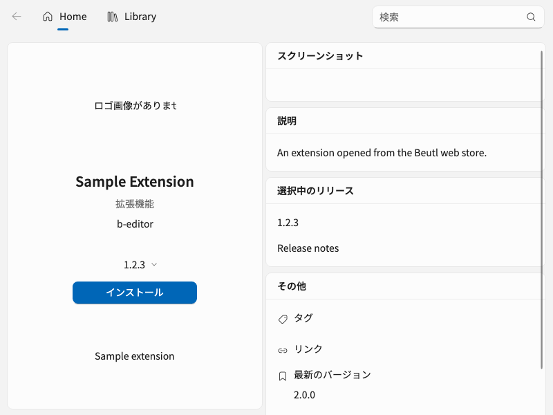

# Opening store packages from the web

Beutl handles `beutl://install?package=Beutl.Sample&version=1.2.3`. The package name
and optional version are URL-encoded query values. An omitted version selects the
latest release. Unknown routes, duplicate/unknown parameters, file paths, remote
download URLs, and invalid package names or versions are rejected.

The request opens the Extensions dialog at the requested package and release.
It reuses an existing dialog and waits for startup/authentication before resolving
the package through Beutl's configured API. A missing release does not select an
alternative. The user confirms installation using the existing desktop controls;
the URL itself never downloads or installs code.

- macOS: the Nuke `BundleApp` target adds `CFBundleURLTypes` to the generated
  `Info.plist` before signing. Avalonia's `IActivatableLifetime` delivers cold and
  warm protocol activations. Dotnet.Bundle 0.9.13 cannot emit these types itself.
- Windows: Inno Setup registers `beutl` with a quoted executable and URI argument.
- Linux: the Debian and Flatpak desktop entries declare `x-scheme-handler/beutl`
  and pass URLs with `%U`.
- Windows/Linux: a bounded, current-user named-pipe handoff forwards a URI-only
  launch to the first running Beutl instance, including during startup. Normal
  launches with other arguments retain their existing behavior.

Protocol registration is part of the packaged installation. Running a development
executable or unpacking a Windows/Linux portable archive does not register it.

## Verification

Run `PackageInstallRequestTests`, `PackageLinkBrokerTests`,
`PackageInstallNavigationTests`, `PackageRelease*`, and
`ExtensionsPageInitialNavigationTests` in `Beutl.HeadlessUITests`. Set
`BEUTL_INSTALL_CAPTURE` to a directory to capture the real package-details UI.

The requested older release is selected independently of the latest release
(headless rendering, fixture data):

For each packaged OS release, install/register the application, then open an actual
published package link from the web store with Beutl closed, running, minimized,
and with the Extensions dialog already open. Confirm the selected version and
that installation waits for the desktop button. Check an unavailable version and
an invalid URL as well. These OS/browser registration checks require the packaged
release; passing headless tests alone does not verify them.
