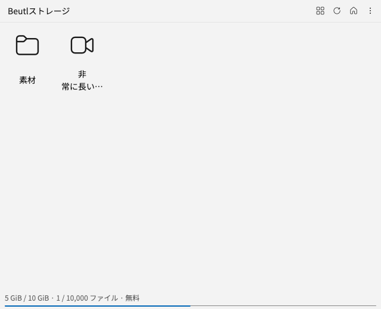

# File browser storage providers

The file browser treats online storage services as registered locations. Local file browsing keeps
its existing implementation. The browser navigation does not depend on Beutl's API or authentication.

These headless captures use synthetic account and file data:

| Dark theme, 320 px | Light theme, 640 px |
| --- | --- |
|  |  |

The integration contract is in `Beutl.Editor.Components.FileBrowserTab`:

- `IFileBrowserStorageProvider` supplies a stable `Id`, a localized `DisplayName`, and `CreateBrowser()`.
- `IFileBrowserStorageBrowser` owns connection state and pending operations, exposes the refresh
  command, and creates the service's content view. Different authentication flows, pagination
  schemes, and available actions stay within the provider.
- `FileBrowserStorageProviderRegistry` holds the configured providers and rejects duplicate IDs.
  The application exposes it through `IEditorContext.GetService`. Every registered provider appears
  automatically in the file browser's location menu.
- Providers can implement `IFileBrowserStorageNavigation` to place breadcrumbs and the display-mode
  switch in the existing toolbar. Expose one stable `ReadOnlyObservableCollection` of breadcrumbs,
  backed by an `ObservableCollection` that the provider updates on the UI thread. Collection changes
  update the toolbar without replacing the browser or its view. `FileBrowserItemView` supplies the
  same icon and compact list presentation as local files, including thumbnail support.

To add a service, implement the two interfaces and register its provider alongside
`BeutlStorageProvider` in the application composition root (`MainViewModel`). No changes to the
file browser's navigation or visibility settings are required. Registration is a snapshot for the
editor session; runtime plug-in discovery is not part of this contract.

## Lifetime

Provider construction and registration must not start authentication or network requests.
`CreateBrowser()` is called only when the user explicitly selects that service. It should return
promptly; the browser performs any asynchronous work with its own cancellation tokens.

Each file browser tab owns an independent storage browser. `CreateView()` may be called more than
once as the dock host recreates views; create a new control bound to the same browser state, without
opening a second connection. A view must not dispose the shared browser when it detaches.

Switching services, returning to local browsing, closing the tab, or disabling online storage
disposes the browser. `Dispose()` must cancel pending work, unsubscribe from account changes, and
prevent late responses from updating the view. Account changes must also clear the previous
account's data before loading the new account.

## Visibility and persistence

`ViewConfig.ShowStorageServices` is a global, persisted option exposed under Settings → View →
File browser. Its default is `true`. Disabling it removes all registered services from the location
menu, disposes active storage browsers, and restores each tab's local location.
Enabling it makes the entries available without opening a service or making requests.

Project layouts retain only the existing local file browser state. They do not save remote account
data, file names, or an active remote connection. Restoring a layout starts locally.

`FileBrowserStorageTests` covers multiple providers, lazy connections, visibility, settings
persistence, view recreation, and cancellation. `CloudStorageTests` covers the Beutl adapter's
authentication and listing behavior.

The Beutl browser retrieves additional pages near the end of the viewport and appends them without
resetting the scroll position. It also fills an underfilled viewport. Requests run one at a time;
refresh, folder changes, and account changes cancel pending work and restart at the first
page. Overlapping file IDs are deduplicated. Append failures retain loaded files and wait for an
explicit retry. The API's page numbers stay internal to the adapter; the UI has no page controls.
`CloudStorageIncrementalTests` covers these paths in both list and icon modes.
The icon panel virtualizes fixed-size tiles inside the existing `ListBox`, retaining selection and
keyboard navigation while limiting realized controls to viewport rows and a small scroll buffer.
