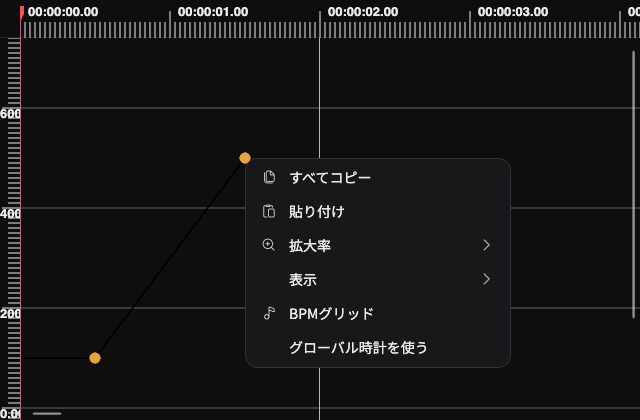
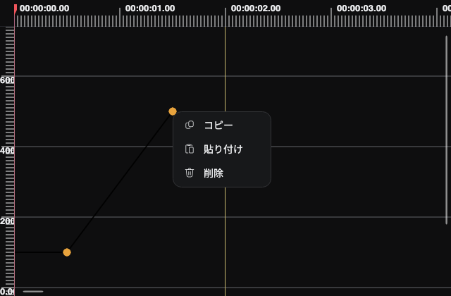

# Graph editor context menu verification

These screenshots use the real `GraphEditorView` with Avalonia Headless and Skia.
The incoming spline control point overlaps the second keyframe. Right-clicking
that point previously opened the background menu; it now opens the keyframe's
Copy, Paste, and Delete menu.

| Before | After |
| --- | --- |
|  |  |

The eight regression cases cover both spline handles, including overlap with the
previous keyframe, Light and Dark themes, deletion of the correct keyframe,
separate handles and background clicks, and normal and Alt-modified left drags.
The six existing graph ruler and theme tests also pass.

To regenerate the current screenshots from the repository root:

```sh
BEUTL_GRAPH_CONTEXT_CAPTURE="$PWD/artifacts/graph-context" \
dotnet test tests/Beutl.HeadlessUITests/Beutl.HeadlessUITests.csproj -f net10.0 \
  --filter 'FullyQualifiedName~GraphEditor' -- NUnit.AssemblySelectLimit=100000
```
