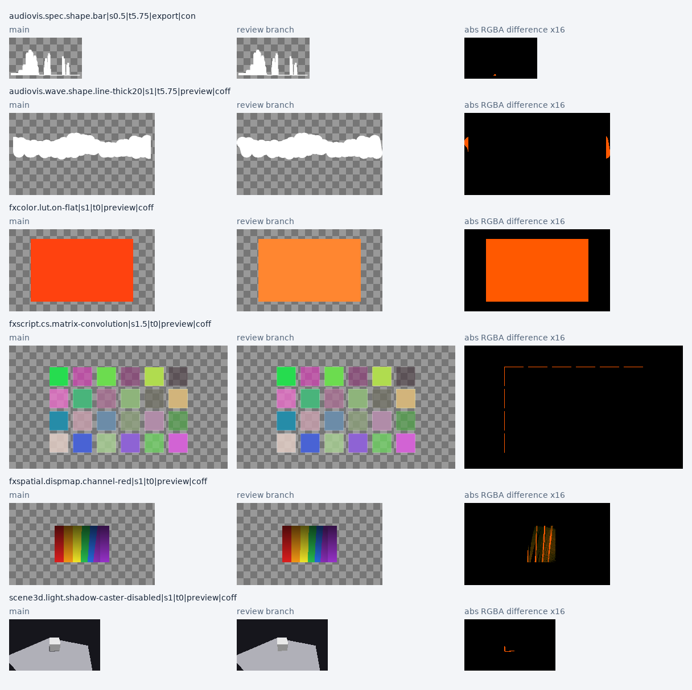

# main 対レビュー修正ブランチの renderdiff

比較コード: `main=8348f5e8da10d4a19da13f9fb3fb7fe5343a9ab0`、`fix/preview-7-review-findings=98a3040340219c33de33448997515de416164ea4`（以降は検証記録のみ）。ハーネスは [b-editor/renderdiff](https://github.com/b-editor/renderdiff) の `4a56166d3bc07f97f8e545d86cdb64aecba60804`。

## 初回の全ショット比較

両側のリストを照合し、**21パック・5,650ケース・94,862ショット**が同じ順序で存在することを確認した。フィルターによる間引きを行わず、パックごとに別プロセスで描画した。

| 項目 | main | 修正ブランチ |
|---|---:|---:|
| 完了ショット | 94,862 | 94,862 |
| 描画エラー | 0 | 0 |
| NaN / Infinity を含むショット | 0 | 0 |
| 非有限RGBA成分 | 0 | 0 |
| 全ビット0の空ショット | 4,671 | 4,671 |
| 片側だけ空になるショット | 0 | 0 |

**93,539ショットが完全一致、123ケース・1,323ショットに画素ハッシュ差分**。サイズ・色形式の不一致、欠落、重複は0。16パックは全ショット一致した。

| 差分パック | ケース | ショット | 対応する修正 |
|---|---:|---:|---|
| 音声可視化 | 74 | 490 | `9a1f4857a` の線・ドットの出力範囲、`1d6dfb5af` の同一resource versionでのスペクトラム再計算抑止 |
| 色効果 | 14 | 210 | `c8d872eb7` のLUTテクスチャの線形色空間指定 |
| スクリプト効果 | 1 | 10 | `9bfc2db3f` のMatrixConvolution左上outsetの符号 |
| 空間効果 | 33 | 610 | `7e5a694d5` の変位マップでpremultiplied RGBにalphaを二重適用しない修正 |
| 3D | 1 | 3 | `ae9c001de` のCastShadows=falseの反映 |

上表の対応は、差分ケースの内容と修正コードを照合した結果。音声可視化以外のケース名はLUT、matrix-convolution、dispmap、shadow-caster-disabledに対応している。単なるハッシュ不一致だけから退行と判定していない。

## 条件

- macOS 26.6.2 / arm64、Apple M3。両側で `--gpu "Apple M3"` を明示。
- `Beutl.Graphics.Backend.Composite.CompositeContext`（Skia/MetalとVulkan/MoltenVK）、MoltenVK 1.4.0。
- .NET SDK 10.0.400、Release、net10.0。両ビルドとも0 errors / 4 warnings（ハーネスの既存nullability警告）。比較ツールは0 errors / 0 warnings。
- 共通のケースソースと同梱フォント・素材。要求された8フォントファミリーの登録を両側で確認。
- 現在のmainにもRenderIntentと既定無効のキャッシュ設定があるため、**両側にBRANCH_PIPELINEを指定**。古いmainを前提にしたREADMEの設定をそのまま使うと、cache-onとdeliveryの条件が揃わない。アプリのソースとハーネスのケースソースは変更していない。
- mainだけに存在する `8348f5e8d`（#2347のゼロ長リサイズ修正）は取り込まず、指定された2つのコードをそのまま比較した。

## 再現性と画素指標

基準側の全21パックを別プロセスで再実行し、**94,862/94,862ショットが初回と完全一致**した。再実行でも描画エラー、非有限成分、欠落・重複は0。

差分1,323ショットを両側で画素ダンプ付きで再生成し、**両側とも1,323/1,323がそれぞれの初回フルパック実行と一致**した。選択したダンプで測定結果が変わっていないことを確認してから、全1,323組の画素指標を計算した。修正ブランチの2回目は差分ショットのみであり、ブランチ全パックを2回実行したとは扱わない。

| ハーネスの差分区分 | ケース数 |
|---|---:|
| A-PRECISION | 1 |
| B-SMALL | 2 |
| C-VISIBLE | 78 |
| D-OVER | 42 |

最大のRGB MAEは **0.0618738**（3D LUT cool）、最小の輝度SSIMは **0.852685**（赤を反転する1D LUT）。D-OVERはSSIM < 0.99またはMAE > 0.02という「元画像との同等性」のしきい値を超える区分で、今回の不具合修正に伴う見た目の変更も該当する。42ケースを一致・軽微な差として扱っていない。

代表画像では、波形の切れていた線端の復元、畳み込みの左上境界、LUTの色、変位量、無効にした影の除去を確認した。初回に差分のあった123ケースは上記の修正対象に対応しており、このコーパスで未説明の差分や新しい描画エラーは確認していない。

[代表画像の一覧](preview7-renderdiff-data/gallery/overview.png) / [画像ギャラリー](preview7-renderdiff-data/gallery/index.html) / [全1,323ショットの画素指標CSV](preview7-renderdiff-data/pixels.csv)



画像は元の線形premultiplied RGBAを市松模様へ合成してsRGB表示したもの。表示用画像だけHDR値をクリップしており、数値指標は元のRGBAから計算している。

## 再実行と証跡

作業場所: `/tmp/beutl-renderdiff-review`。結果: `/tmp/beutl-renderdiff-review/out/preview7-review-20260910`。

```sh
dotnet wt-main/renderdiff/bin/Release/net10.0/RenderDiff.dll render-packs --out out/preview7-review-20260910/main --gpu "Apple M3"
dotnet wt-branch/renderdiff/bin/Release/net10.0/RenderDiff.dll render-packs --out out/preview7-review-20260910/branch --gpu "Apple M3"
dotnet compare/bin/Release/net10.0/Compare.dll out/preview7-review-20260910/main out/preview7-review-20260910/branch out/preview7-review-20260910/diff-ids.txt
```

小さな集計・画素指標・代表画像は [preview7-renderdiff-data](preview7-renderdiff-data/) に同梱した。全ショットのマニフェストと約1.6GBの生画素ダンプは上記のローカル結果ディレクトリに保存している。

主な成果物:

- `comparison-inputs.json`: コミット、共通ソースのSHA-256、実行環境、使用EngineバイナリのSHA-256。
- `main/manifest.jsonl`, `branch/manifest.jsonl`: 全ショットのハッシュ、形状、色形式、非有限成分、空判定。
- `audit-initial.json`, `summary.txt`, `blankdiff.txt`, `diff-ids.txt`: 全件照合。
- `initial-runs.json` と各パックのログ: 初回main 18分57秒、修正側16分36秒。実行順・ドライバーキャッシュなどを統制した性能ベンチマークではないため、速度改善の根拠にはしない。

Windows/Linux、実デコーダを必要とする動画、GPU allocation failureなど、ハーネスの未収録条件はこの結果で検証済みとはしない。GPU割り当ての性能課題など、既存のIssueもこの画素比較で解決したとは扱わない。
