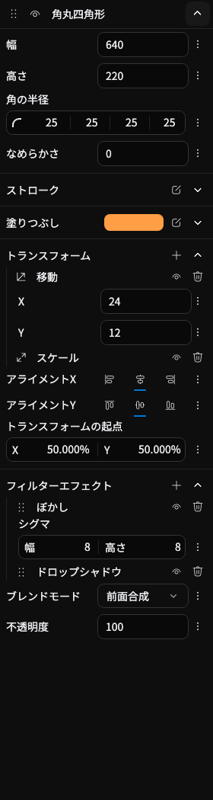
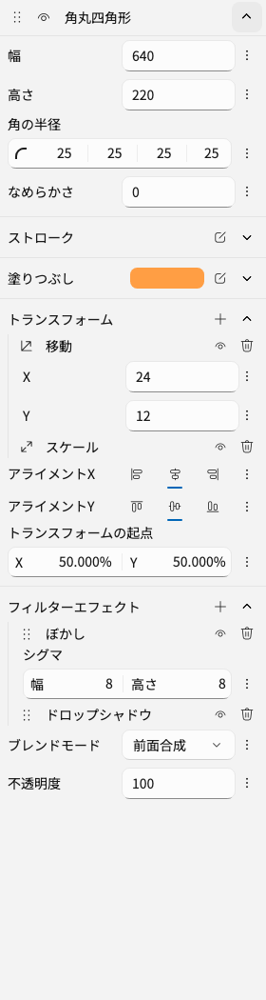
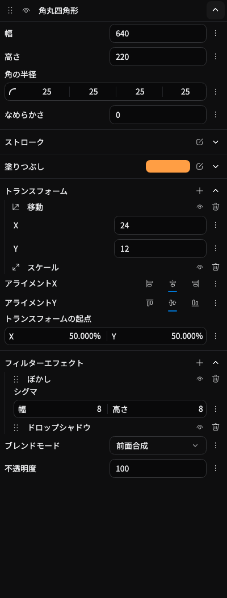
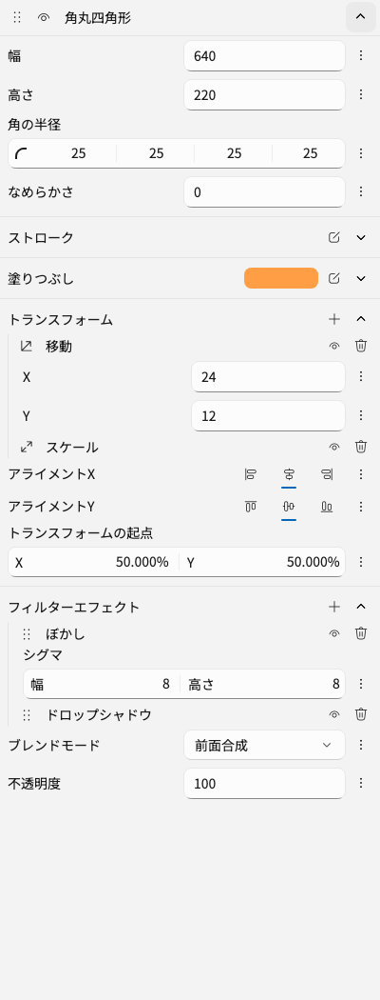
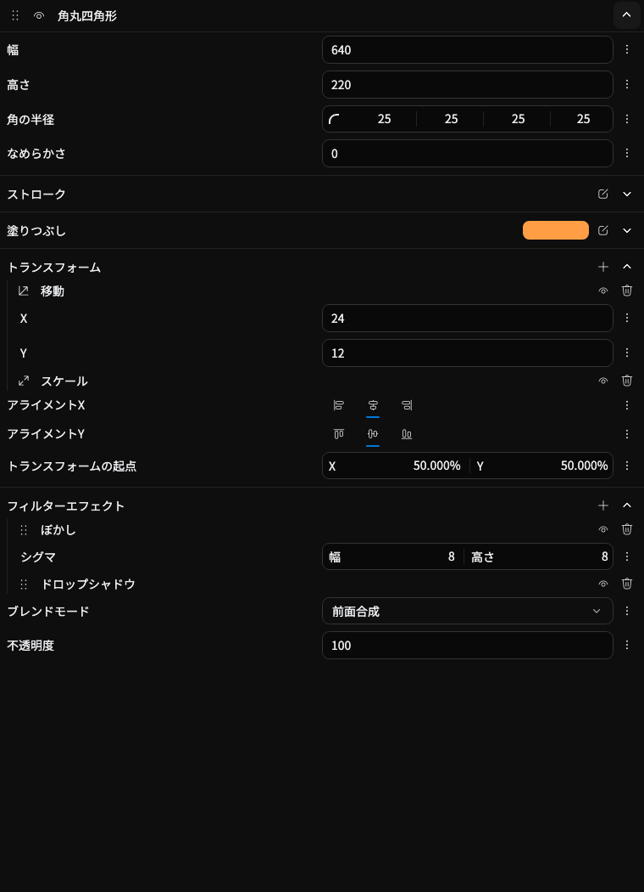
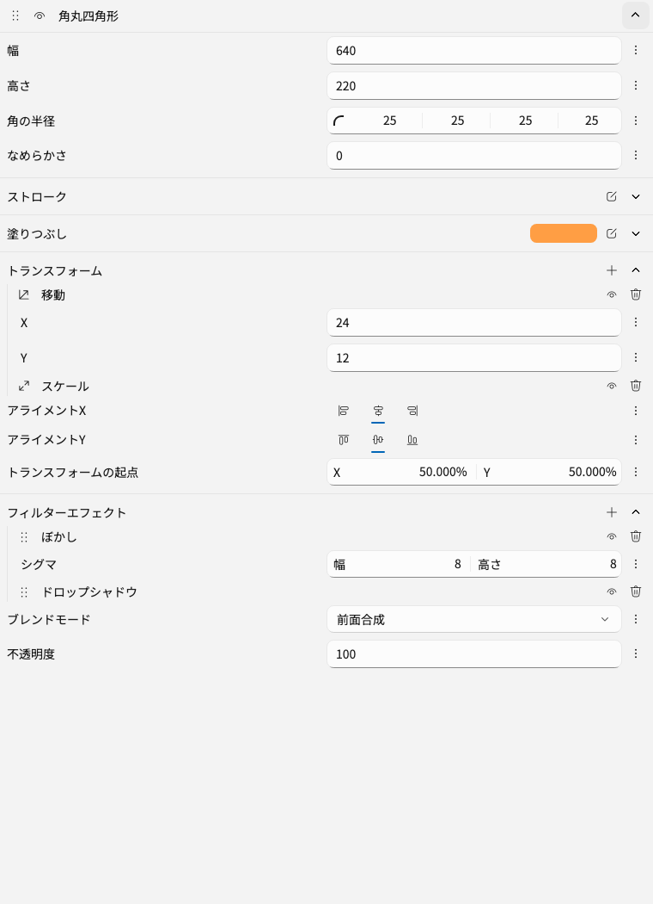

# Property editor layout verification

The screenshots below use Avalonia Headless with Skia drawing and the actual
`ElementPropertyTabView`. The selected element contains a rounded rectangle with
translation and scale transforms, plus blur and drop-shadow effects. The inspector
uses real property-editor view models with a minimal editor host; it does not
render a scene preview.

The value column defaults to half the available label/input space. Multi-value
editors place their input beside the label when their local width permits it and
below the label when narrower. At inspector widths of at least 640px, inline
inputs share a left edge across nesting levels. Alignment buttons retain their
ordinary right alignment below that threshold and their existing compact layout
at widths of 224px or less.

## Expanded inspector

| Width | Dark | Light |
| --- | --- | --- |
| 280px |  |  |
| 400px |  |  |
| 760px |  |  |

## Reproduce

From the repository root:

```sh
BEUTL_LIST_EXPANSION_CAPTURE="$PWD/output/property-editor-layout" \
dotnet test tests/Beutl.HeadlessUITests/Beutl.HeadlessUITests.csproj \
  --filter 'FullyQualifiedName~AlignmentEditorLayoutTests|FullyQualifiedName~ColorEditorAlignmentTests|FullyQualifiedName~ListItemExpansionTests|FullyQualifiedName~PropertyEditorGridTests|FullyQualifiedName~TreeLineDecoratorRenderingTests'
```

The capture produces 30 PNGs: three widths, two themes, and five list states
(collapsed, expanded, hovered while collapsed, hovered while expanded, reordered).
The six expanded screenshots are retained here for review.

The 31 test cases cover:

- Color and alignment input placement with and without keyframe controls.
- Shared input alignment, splitter movement, reparenting, and preservation of
  focused text edits while resizing.
- Repeated splitter movement against the minimum label width and back, initiated
  from both outer and nested rows at 760px and 1040px.
- Disabling an alignment scope while its editors remain attached.
- Finite horizontal layout and shared input edges in the actual selected-element
  inspector, including expanded transform properties in both themes.
- List expansion by pointer and keyboard, unchanged grip backgrounds on expansion,
  visibility toggles, reordering, and deletion.
- Nesting-line pixel thickness against a separator at render scales from 1x to 2x.

These are focused inspector checks; they do not exercise the full app shell,
scene rendering, or export workflows.

The inspector's ScrollViewer already disables horizontal scrolling through
[Avalonia 12.1.2's default](https://github.com/AvaloniaUI/Avalonia/blob/12.1.2/src/Avalonia.Controls/ScrollViewer.cs#L72-L75).
The selected-element test checks the effective setting
and input positions in the real view, rather than relying only on an isolated
alignment scope.
