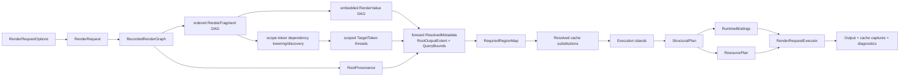

# Data Model: Renderer-Wide GPU Pass Fusion

## Relationship overview



## Public authoring entities

### RenderNode

Represents one author-defined step in a render-node tree.

| Field/member | Meaning |
|---|---|
| `Process(RenderNodeContext)` | Records the node transaction and returns no value. |
| `Cache` | Persistent output-cache policy/state associated with the node. Lookup does not occur inside `Process`. |
| `HasChanges` | Existing invalidation input; contributes to cache identity/versioning. |

Invariants:

- Recording uses the normal bottom-up traversal: child input streams are recorded before their parent node's `Process` call. Every concrete node, including `LayerRenderNode`, follows this rule; there is no concrete-node pre-order bypass.
- `Process` is called at most once per node occurrence in one recording traversal unless the graph explicitly contains multiple occurrences.
- A request-family active-node guard rejects self/ancestor recursion before invocation; only completed sequential occurrences may reuse the same node object.
- `Process` performs no drawing, media decode/read, target allocation/materialization, GPU access, nested execution, snapshot, flush, synchronization, or readback.
- The node publishes value/effect fragments only through its active context.

### RenderNodeRenderer

A disposable high-level owner for repeated requests over one borrowed root node.

| Field | Meaning |
|---|---|
| `Root` | Borrowed node; never disposed by the renderer. |
| options snapshot | Sanitized request defaults and borrowed target-factory reference. |
| structural/program caches | Persistent reusable compiled state owned by this renderer. |
| target pool | Owns every target accepted from `IRenderTargetFactory` while pooled/request-leased; successful cache publication transfers its payload to `RenderNodeCache`. |
| internal diagnostic state | Renderer-owned evidence state; it is not exposed as a public provider, sink, or snapshot schema. |
| state | `Active` or `Disposed`; disposal is idempotent and later calls fail. |

The caller owns the disposable `RenderNodeRasterization` returned by `Rasterize`; that result in turn owns its optional bitmap. Render destinations, the root and its existing cache, and the factory remain borrowed. One renderer instance does not support concurrent requests; separate instances own independent persistent state. There is no list-returning rasterizer because a fragment stream denotes one painter-ordered result.

### RenderNodeRasterization

A disposable single-output rasterization result.

| Field | Meaning |
|---|---|
| `Bounds` | Exact logical raster domain selected for this request: the explicit `RequestedRegion`, or `RootOutputExtent` when the option is null. |
| `OutputScale` | Density used to rasterize `Bounds`. |
| `Bitmap` | Optional bitmap owned by this result. It is non-null exactly for a non-empty raster domain. |
| `IsEmpty` | True when `Bounds` is empty and no bitmap was allocated. |

Disposal is idempotent and disposes the owned bitmap exactly once. Empty output is a normal result rather than an attempt to allocate an invalid zero-area bitmap.

### RenderNodeMeasurement

An immutable metadata-only result containing execution-facing `OutputBounds` (`RootOutputExtent`), query-facing `QueryBounds`, aggregate `EffectiveScale`, materializable `ValueCardinality`, and the independent flags `HasFragments`, `HasContributingValues`, and `HasTargetEffects`. A command-only result can therefore report `HasFragments == true`, `ValueCardinality.None`, and `HasTargetEffects == true`; a published non-contributing capture reports a value without claiming a visible contribution. Measurement never executes deferred work and is distinct from internal request diagnostics.

### RenderNodeContext

A transaction-scoped facade over an internal `NodeRecordingTransaction`.

| Field | Meaning |
|---|---|
| `Inputs` | Ordered, borrowed fragment-stream handles, including effect-only commands. The node never disposes them. |
| `Purpose` | `Frame`, `HitTest`, `Bounds`, `CacheWarmup`, or `Auxiliary`. |
| `Intent` | `Preview` or `Delivery`. |
| `OutputScale` | Final root density; not an intermediate ceiling. |
| `MaxWorkingScale` | Global intermediate quality ceiling; `+Infinity` means none. |
| `IsRenderCacheEnabled` | Effective inherited cache eligibility; read-only and monotonic. |
| pending fragments/values | Semantic values, target commands/captures/current-target scopes, scope-relative `TargetLayerScope` effects, finite value-producing Layers, materialized inputs, or opaque records created in this transaction. |
| pending publications | One ordered list of handles explicitly published through `Publish`/`PublishRange`. There is no separate command side list. |
| pending resources | Disposable ownership transferred to the transaction. |

State:

```text
Open -> Committed -> Invalid
  \-> RolledBack -> Invalid
```

- Only `Open` accepts reads/recording/publication.
- `Committed` atomically moves pending state to the parent request or parent node transaction.
- `RolledBack` publishes nothing and releases every pending owned resource best-effort.
- `Invalid` rejects retained context and handle use deterministically.

### RenderFragmentHandle

A sealed public handle to an ordered logical fragment stream. It is not executable work itself.

| Field | Meaning |
|---|---|
| internal owner/id | Identifies one transaction-local fragment edge; never public. |
| `Bounds` | Conservative value/query metadata represented by the stream. It never resolves a symbolic `TargetRegion.Full` or supplies a target domain. Non-contributing anchors retain dependency bounds internally but do not enlarge root query bounds. |
| `EffectiveScale` | Densest concrete value supply represented by the stream, or `Unbounded` when no concrete reusable value supply exists. |
| `ValueCardinality` | Declared minimum and maximum materializable value count, independent of fragment existence. |
| `ContributesValuesToTarget` | Whether replay automatically composites carried values; it says nothing about target-command side effects. |
| `CanBeUsedAsValueInput` | Whether all possible runtime values are exposed to value-consuming APIs after scheduling explicit dependencies; it does not imply purity or target independence. |
| `HitTest(Point)` | CPU-only aggregate hit-test over declared output metadata. |

Invariants:

- A handle is accepted only by its active owning context. A nested transaction receives fresh child-owned facade handles mapped to the same internal fragment IDs; it never receives parent objects. Child facades invalidate on child exit, original parent handles remain active, and committed child publications are re-exposed as fresh parent-owned handles.
- There is no public constructor, render method, factory, disposal, equality-by-id contract, or cross-request retention.
- Publishing one handle publishes its complete ordered fragment stream. Pure fan-out is legal; effectful duplication is rejected except for a target capture executed once and shared by pure consumers. Pure sources/materialized values, target captures, finite Layers, and eligible value maps can be value inputs; commands, Blend, current-target scopes, `TargetLayerScope`, raw target forms, and mixed sequences cannot until the author deliberately wraps the sequence in a finite Layer.
- Recording a fragment immediately computes and memoizes conservative pure forward/value/query metadata from already-recorded inputs. Handle properties read it during downstream recording; runtime shrink/discard can narrow only within the declaration.

`CanBeUsedAsValueInput` propagation is fixed by the public contract rather than inferred by the planner: Shader, Geometry, and opaque maps require an eligible input and return eligible values; combine/expand require every input eligible and return eligible values; Opacity preserves eligibility only for an eligible child; OpacityMask additionally requires every lowered mask dependency eligible and no raw fallback; Blend, TargetScope, `TargetLayerScope`, RawTargetScope, and both command forms return false; source/materialized/capture/finite Layer return true; and `ContributeValues` requires/preserves true. Nested recording preserves each child handle's recorded result. Public contract tests cover every rule and the primary `Shader -> Opacity -> Shader` proof.

### RenderValueCardinality

Declares materializable value count without forcing recording-time execution. Effectful fragment existence is a separate internal fact.

| Field | Rule |
|---|---|
| `Minimum` | Non-negative. |
| `Maximum` | `null` for unbounded/runtime-dynamic; otherwise `>= Minimum`. |

Named values include `None` (`0..0`), `Single` (`1..1`), `ZeroOrOne` (`0..1`), and `Dynamic` (`0..unbounded`). Fixed cardinality is represented by equal minimum/maximum.

Shader, opacity, current-target scopes, and `TargetLayerScope` preserve declared value cardinality, although `TargetLayerScope` remains value-input-ineligible. Geometry and opaque map produce one or zero-or-one value per value input while preserving order. Combine produces at most `Single`; finite Layer produces exactly `Single`; expansion declares arbitrary fixed or dynamic range. `TargetCommand` is a published effect fragment with `None`; `TargetCapture` is `Single` but initially non-contributing. The planner never infers either fragment existence or cardinality from empty bounds.

### RenderScaleUtilities

The independent public owner of feature 003's pure scale helpers: `MaxBufferDimension`, max-scale sanitization, working-scale resolution, and complete-bounds buffer-budget clamping. These calculations are intentionally not members of the transaction-scoped recorder because 3D, brushes, export policy, and the planner use them without a `RenderNodeContext`.

### RenderResource<T>

A request-scoped token returned when a context accepts an owned disposable or an externally borrowed reference-type resource.

| Field | Meaning |
|---|---|
| owner/id | Transaction/request owner and resource slot. |
| mode | `Owned` or `Borrowed`. |
| state | Owned: Pending -> RequestOwned -> LeasedToCallback -> RequestOwned -> Discharged; Borrowed: BorrowedPending -> RequestBorrowed -> LeasedToCallback -> RequestBorrowed -> ReleasedToken. |
| cache identity | Equality-stable runtime key plus caller-supplied content version, or a unique non-reusable slot identity by default. |

`Own<T>` requires `T : class, IDisposable`; `Borrow<T>` and `RenderResource<T>` require only `T : class`. The request-family raw-reference table rejects duplicate Own and any Own/Borrow conflict. Repeated Borrow with an explicit non-null key coalesces only with the same key/version; an explicit mismatch is rejected, while each null-key registration gets a distinct request-local identity and cannot reuse output cache across requests. The raw value is exposed only inside an authorized execution callback. Every consuming description lists its token, causing key/version to enter output-cache identity; undeclared use is rejected. An owned slot is discharged exactly once by rollback/teardown disposal or by an atomic ownership transfer into an accepted persistent cache payload; the request then holds no lease to it. Borrowed teardown invalidates only the token; both owner and callback keep pixel-affecting state read-only throughout the request. Metadata-only requests never access the raw value. Keys retained by caches are lightweight immutable equality-stable CPU IDs, never resource/context/native objects or large payloads.

### RenderRuntimeIdentity

An equality-stable, non-null runtime key for pixel-affecting scalar/value state that is captured by a deferred callback rather than held in a disposable resource. It participates in render-output cache identity but never structural plan/program identity. A null description identity instructs the recorder to generate a fresh request-local identity, safely disabling cross-request pixel-cache reuse. Built-in semantic descriptors include their scalar values automatically, and Shader uniforms contribute their canonical validated values automatically.

## Shared effect descriptions

### RenderBoundsContract

Describes coordinate behavior independently of execution.

| Field | Meaning |
|---|---|
| forward map | Complete logical output bounds from complete logical input bounds. |
| backward map | Required logical input region for a requested logical output region. |
| `RequiresFullInput` | Conservative alternative when a tight backward map cannot be proven. |
| structural identity | Stable method/kind identity excluding captured runtime parameter values. |

Kinds:

- `Identity`: forward/backward identity, not full-input.
- `FullInput`: forward identity, backward requests complete input.
- `Create`: explicit forward and backward delegates.
- `CreateFullInput`: explicit forward delegate, backward conservatively requests complete input.

`default(RenderBoundsContract)` is invalid and rejected at description construction.

### ShaderDescription

Immutable description of one element-wise Shader operation.

| Field | Structural or runtime | Meaning |
|---|---|---|
| `Kind` | Structural | `CurrentPixel` or `WholeSource`. |
| normalized source text | Structural | Validated SkSL source. Full text participates in equality. |
| stable source hash | Structural bucket only | Deterministic cache bucket; never sufficient for equality. |
| uniform names/types/order | Structural | Binding signature. |
| uniform values/providers | Runtime | Direct values bind canonically; custom providers may use final bounds/density/device context. |
| child/sampler names/types/order | Structural | Binding signature and resource budget. |
| child/sampler coordinate spaces | Structural | Value, output-logical, or output-device; CurrentPixel accepts value only. |
| child/sampler providers/resources | Runtime | Resolved only by the executor. |
| runtime identities | Runtime | Canonical uniform values, resource key/version, and any explicit resource-binder scalar key. |
| bounds contract | Structural behavior | Identity for CurrentPixel; mandatory explicit contract for WholeSource. |
| color/alpha contract | Structural | Linear-light RGBA16F, premultiplied input/output for this feature. |

CurrentPixel validation proves the restricted coordinate form and is the sole Shader fusion eligibility source within one resolved-coverage domain. CurrentPixel consumes premultiplied pixels after upstream analytic/antialiased coverage has been applied. Coordinate validation does not prove `f(kx) = kf(x)` for partial coverage, so an arbitrary public stage cannot fold into vector, text, path, or antialiased-clip coverage generation. Only an engine-known participant with mechanically proven premultiplied-coverage homogeneity may carry a compiled run across that boundary; no public author flag supplies this proof. WholeSource never becomes fusible from an author flag. Its coordinate is local output device pixels; runtime context carries logical origin, required region, device bounds, output density, and input supply density so implicit source and declared resources map coordinates without recording-time assumptions.

Direct uniform values automatically enter output-cache identity. Custom uniform providers include their passed value but default to a request-unique runtime identity unless the author supplies a complete key for any additional captured/global state; resource binders use the same rule. Source/binding shape remains structural and does not vary with those runtime values.

### GeometryDescription

Immutable deferred one-input/zero-or-one-output operation.

| Field | Meaning |
|---|---|
| callback | Invoked later by the executor. |
| bounds contract | Mandatory forward/backward behavior. |
| hit-test contract | Mandatory CPU-only conservative metadata behavior. |
| structural key | Stable geometry-kind identity; excludes animated captured values. |
| runtime identity | Explicit cache identity for captured scalar/value state, or request-unique when null. |
| `RequiresReadback` | Schedules an explicit input synchronization before callback execution. |
| resources | Explicit request-owned tokens whose key/version enters output-cache identity. |

Geometry is always an execution-island boundary in this feature. It maps each input to zero or one ordered output and may shrink the result within allocated forward bounds.

### GeometrySession and RenderExecutionInput

Callback-scoped borrowed views.

`GeometrySession` exposes complete output bounds, resolved required region/device bounds, output scale, working scale, maximum working scale, request purpose/intent, one shared `RenderExecutionInput`, and a non-disposable scoped canvas facade over the executor-owned output. The facade exposes the cropped logical allocation, canonical global `DeviceBounds`, and rounded `LogicalOrigin`; its one-shot canvas is pretranslated/clipped so author coordinates remain composition-global and closes without an implicit flush. The raw `ImmediateCanvas` is capability-guarded: it rejects author disposal, snapshot, nested drawing, undeclared resources, every `SaveLayer`-backed opacity/blend/mask/paint API, hidden allocation, and any hidden flush/synchronization. `RenderExecutionInput` exposes logical bounds, concrete supply density, device size, scoped sampling/blit operations, and a one-shot `UseSnapshot` scope enabled only when the owning description declares input readback.

State:

```text
Active -> Closed
```

All methods validate the shared active token. `UseSnapshot` additionally requires `RequiresReadback`; the request owns its temporary bitmap, invokes the action synchronously, and disposes it before return. The planner-owned output is transparently cleared inside the scheduled Geometry island before callback entry. Standard supply-driven density is resolved per element from output scale/input supply/max/clamp. The output may transition `Keep -> Shrink` or `Keep/Shrink -> Discard`; it may never grow beyond allocated bounds. The callback does not own or dispose input/output/snapshot resources.

### TargetCapture, TargetScope, TargetLayerScope, Layer, and TargetCommand descriptions

- `TargetCapture` consumes the preceding scope-local token and produces a non-contributing request-owned value. Its finite content bounds, Full/finite source region, hit test, and concrete standard/custom capture density are pure metadata. The standard density is output-derived; a custom resolver always receives an empty `InputSupplies` list and may use only `OutputBounds`, `OutputScale`, and `MaxWorkingScale`. Neither observes the owning target density resolved later during scope-token lowering. Public capture is therefore an intentional materialization/resampling boundary and may downsample a denser finite Layer or TargetLayerScope rather than preserving that target losslessly. The resulting concrete density is exposed through `EffectiveScale`. Only the internal backdrop capture may late-bind to the owning scope density without publishing an unresolved public handle. `ContributeValues` explicitly enables later automatic compositing; unary transforms preserve the flag.
- `TargetScope` is a same-target per-fragment map restricted to mechanically allocation-free transform/clip state plus exactly one replay. Opacity and Blend are planner-visible typed layer scopes. OpacityMask snapshots a `Brush.Resource` declaratively during recording, lowers known brushes to internal shader/value dependencies, and records DrawableBrush content as inherited nested work; it never calls `BrushConstructor` during execution.
- Public `TargetLayerScope(inputs, TargetRegion)` is a scope-relative offscreen-isolation effect recorded through the same normal bottom-up `Process` path as every other node. A non-empty resolved region replays the ordered input stream into one transient local target and composites that target back into the current painter target; `Empty` preserves order without allocating a target or executing pixel work. A `Full` region remains symbolic during recording and becomes finite only during scope-token dependency lowering, after enclosing transforms, clips, external-root domains, and finite Layers are known. The scope preserves declared cardinality for dependency accounting but has `ContributesValuesToTarget == false` and `CanBeUsedAsValueInput == false`; non-empty offscreen materialization remains required unless the planner proves an equivalent removal. Existing `LayerRenderNode` default/`PushLayer(default)` records this typed public shape with `TargetRegion.Full`.
- `RawTargetScope` is the marked opaque-external decorator escape and `RawTargetCommand` is its zero-input painter-target counterpart. Both conservatively access `TargetRegion.Full` as read/write because raw callback bounds are query metadata, not enforceable access limits.
- Public `Layer(inputs, Rect domain)` is the distinct reusable-value constructor. It replays an arbitrary mixed fragment sequence into one finite non-empty local target and emits exactly one outer value, so nested commands consume that local token. Invalid/empty domains are rejected and Layer never accepts Full. Its content bounds union contributing child values with potentially pixel-writing target-effect regions after scope transforms and clip to the explicit domain; read/order-only accesses do not add content and hit testing remains based on query metadata.
- `TargetCommand` is an effect fragment with value cardinality `None`, separate `TargetRegion` access and visible `QueryBounds`/hit-test metadata, a conservative prior-token dependency, and zero or more inputs that MUST each have `CanBeUsedAsValueInput == true`. Target readback snapshots the pre-command token exactly once; input readback is a separate explicit description flag.

`TargetRegion` is `Full`, `Empty`, or finite `Region(Rect)`; default is invalid. Full resolves to the finite current external-root, `TargetLayerScope`, or Layer target domain. For root X-domain `[0, 100)`, the ordered sequence `Transform(+10) -> PushLayer(default) -> Full clear` resolves the nested local Full region to `[-10, 90)` during lowering; resolving it to `[0, 100)` while recording would incorrectly miss root `[0, 10)`. Empty readback is invalid. Public commands are `ReadWrite`/`Readback`; only engine-proven capability-enforced work may be internally write-only.

## Recorded request entities

### RenderRequestOptions

Immutable options inherited by the request and nested requests.

| Field | Meaning |
|---|---|
| `Intent` | Preview/delivery allocation-failure behavior. |
| `Purpose` | Frame/query/cache/auxiliary behavior. |
| `TargetDomain` | Optional finite non-empty root domain for target-less Rasterize/Measure/HitTest. A real destination overrides it; null is valid only when scope-token lowering finds no root `TargetRegion.Full` access that requires an available destination domain. |
| `RequestedRegion` | Final root logical output requirement/commit crop: null selects `RootOutputExtent`; a non-null value is an explicit empty or finite region. It is not the current target domain. Invalid rectangles are rejected. |
| `OutputScale` | Final root density. |
| `MaxWorkingScale` | Intermediate quality ceiling. |
| `CachePolicy` | Effective persistent/transient cache permissions. |
| internal `FusionMode` | `Enabled` for production; friend evidence tests may select `Disabled` compatibility partitioning. It is inherited by nested requests and participates in structural-plan identity, but is not exposed through public renderer options. |
| allocator/failure owner/internal diagnostics | Shared resource owner, cleanup/failure aggregation, and internal evidence state inherited by nested requests; none is a public completion sink. |
| target/backend identity | Externally owned destination and backend capabilities. |

### RecordedRenderGraph

Request-owned immutable result of successful recording transactions.

| Collection | Contents |
|---|---|
| fragments | Ordered/composable `RenderFragment` records and publication roots. |
| values | Topologically addressable `RenderValue` records embedded by fragments. |
| scoped target tokens | Target-state transitions created only during scope-token dependency lowering for the external root, `TargetLayerScope`, and finite Layer scopes. |
| roots | Published final fragment streams plus external presentation target. |
| provenance | Renderer entry/node/cache origin for fragments, values, commands, and captures. |
| cache candidates | Candidate subtree boundaries recorded without lookup. |
| owned resources | Resources transferred by committed transactions. |
| nested requests | Separate-target requests with inherited options/owners. |

After recording, author contexts/handles are invalid. Internal IDs and their memoized conservative metadata remain valid through planning/execution. Scope-token dependency lowering/discovery runs immediately after recording and before graph-wide forward metadata resolution; it resolves scope-relative regions and introduces every target-token dependency needed by later analyses.

### RenderFragment

One execution-relevant compositional IR record.

| Field | Meaning |
|---|---|
| `FragmentId` | Request-local stable identity. |
| kind | Value contribution, target command, target capture, sequence, current-target scope, scope-relative `TargetLayerScope`, finite Layer, nested/backend, or opaque external. |
| ordered children/value edges | Child fragments and embedded values in authored order. |
| value cardinality/contribution | Materializable value count plus independent automatic-composite flag. |
| value-input eligibility | Whether all runtime values can be supplied to a value consumer after explicit dependencies are scheduled. |
| content/query metadata | Dependency bounds versus visible root bounds/hit testing. |
| target behavior | None, same-target replay, scope-relative offscreen isolation, finite value-producing local target, read/write region, or token-to-value capture. |
| provenance/cache identity | Node/root origin and structural/runtime identities. |

Target commands and non-contributing captures remain real fragments even with no visible query bounds. Pure value transforms can be extracted/fused through the embedded value DAG only when fragment ordering, scope, and target-token equivalence remain intact.

### RenderValue

One typed value-producing IR record.

| Field | Meaning |
|---|---|
| `ValueId` | Request-local stable identity. |
| kind/descriptor | Source, opacity, transform, clip, Shader, Geometry, combine, expansion, materialized, opaque, or backend. |
| inputs | Ordered upstream `ValueId`s. |
| cardinality/topology | Source, map-each, combine, expand; fixed or dynamic count. |
| bounds contract | Sound forward/backward mapping or conservative full input. |
| scale contract | Vector/concrete supply and materialization policy. |
| hit-test contract | CPU-only metadata mapping. |
| dependencies | Readback, backend, target capture, external ownership, dynamic topology. |
| structural identity | Kind, placement, signature, and structural key. |
| runtime output identity | Built-in parameters, description runtime keys, uniform values, and declared resource identities/versions. |
| provenance/cache candidate | Origin and cache boundary annotations. |

An opaque record remains typed with respect to topology, bounds, density, hit testing, readback, and ownership, but its pixel semantics are unknown and it is never fused.

`RenderScaleContract` is either vector/unbounded, input-supply preserving, standard supply-driven materialization, or a pure CPU custom resolver. A custom resolver runs once at value recording from already-memoized input supplies and complete conservative output bounds and cannot observe the later requested region. It must return a finite value greater than zero; a throw or invalid result fails and rolls back the current recording transaction rather than selecting a fallback. A valid result is capped by `MaxWorkingScale` plus the per-buffer dimension clamp against those complete output bounds. That concrete result becomes the public handle's eager `EffectiveScale`. Later ROI crops logical allocation bounds without changing density. The resolver identity is structural while the resolved density is runtime data.

### TargetCommand, TargetCapture, and TargetToken

Scope-token dependency lowering threads a `TargetToken` independently through the external root, every non-empty `TargetLayerScope`, and every finite Layer. An empty `TargetLayerScope` remains an order-only fragment and creates no local target-token chain. A `TargetCommand` consumes/emits the current token. A `TargetCapture` consumes/emits it plus an immutable value. Each carries structural/runtime identity and Full/Empty/finite access; visible query metadata is independent. A Readback command schedules an immutable pre-command bitmap scope and disposes it before return.

`TargetLayerScope(TargetRegion.Full)` resolves only in this lowering phase. The lowering composes every enclosing transform and clip before mapping the finite destination scope into the layer's local coordinates. Consequently, for root X-domain `[0, 100)`, `Transform(+10) -> PushLayer(default) -> Full clear` assigns local X-domain `[-10, 90)` rather than freezing the root coordinates as `[0, 100)`. A Full access that reaches the external root requires a real destination or explicit finite `TargetDomain`; `QueryBounds`, `RootOutputExtent`, `RequestedRegion`, and finite value anchors are not target-domain sources.

Command kinds include clear/source-replace, guarded custom target draw, backdrop draw, explicit target readback, raw target command, and external presentation. Capture is a distinct token-to-value edge. `ContributeValues` is a distinct value-contribution wrapper. Opacity, Blend, OpacityMask, guarded TargetScope, and RawTargetScope are scope fragments rather than commands. Empty query bounds or value cardinality `None` do not delete an effect fragment. Commands/captures/scopes are barriers unless a concrete equivalence rule proves a fold.

### RootProvenance

Links renderer entries and node/cache occurrences to fragment/value/command/capture IDs.

It retains:

- original metadata producer independent of cache substitution;
- painter-order index;
- node/cache candidate hierarchy;
- bounds/hit-test group;
- frame render-count and cache publication owner.

Renderer entry `QueryBounds` are the union of contributing-value query bounds and target-command/scope query bounds, not non-contributing capture dependency bounds or cached temporaries. Hit testing walks the same visible provenance in reverse top-level painter order and applies the optional final requested-region clip.

### RootOutputExtent and QueryBounds

Forward analysis retains two independent root aggregates:

- `RootOutputExtent` is the conservative execution/output union of contributing value bounds and every potentially pixel-writing root target-effect region after scope transforms and clips. A finite Layer first aggregates writes into its one emitted value; a `TargetLayerScope` maps its local writes back as an effect on the enclosing target. Read-only captures and order-only target accesses do not enlarge the extent.
- `QueryBounds` is measurement/layout and hit-test provenance. It is the union described by `RootProvenance` and does not become larger merely because an effect may write a target region.

Potentially writing work remains in `RootOutputExtent` even when its query metadata is empty. Therefore a Full root Clear can have empty `QueryBounds` while still requiring the full finite root output extent. `RenderNodeMeasurement.OutputBounds` reports `RootOutputExtent`, `RenderNodeMeasurement.QueryBounds` reports the query aggregate, and a null `RequestedRegion` selects `RootOutputExtent` for backward ROI, final commit, and `RenderNodeRasterization.Bounds`.

## Analysis and planning entities

### ResolvedMetadata

Per-fragment/value analysis result containing forward content/query bounds, root `RootOutputExtent` and `QueryBounds`, contribution state, aggregate/per-output scale facts, value cardinality, lowered target region, hit-test mapping, and validity/empty state. Resolution errors are planning failures, not identity operations.

### RequiredRegionMap

Maps each value and relevant target dependency to an explicit `Full`, `Empty`, or finite `Region(Rect)` state after reverse propagation. A non-null `RequestedRegion` is the explicit final output/commit requirement; null seeds the root requirement from `RootOutputExtent`, never from `QueryBounds`. The separately lowered target Full remains the available scope domain so capture/read aprons may expand up to it. Multiple consumers union requirements. An invalid rectangle is a planning error and never aliases Full.

### CacheCandidate and CacheResolution

`CacheCandidate` identifies a recorded subtree result, its hierarchy, cache policy, and provenance. `CacheResolution` is one of:

- `Bypass`: ineligible/disabled;
- `Hit`: execution producer replaced by a `MaterializedInput`, original metadata retained;
- `MissCapture`: current schedule produces the value and captures it after success;
- `Superseded`: a parent or more appropriate child candidate owns the selected boundary.

A hit is valid only when identity, bounds/coverage, density, format, intent/purpose policy, and device/context match. Capture publication is atomic with complete request success.

A candidate transitively containing a target command, current-target/external scope, or target capture is `Bypass` for whole-subtree output caching unless the complete prior-token pixel identity/coverage is immutable and known. External-root prior pixels are request-unique and never cross-request hits. Pure nested value candidates remain eligible; substitution rewires only value producers while every fragment/token edge stays in authored order/scope.

### ExecutionIsland

A maximal dependency-consistent region sharing backend/cache/lifetime policy.

Island boundaries include:

- cache materialization/capture;
- opaque or Geometry execution;
- target command/capture/current-target scope, scope-relative `TargetLayerScope` offscreen isolation, and raw target work;
- explicit readback;
- destination-dependent Blend or another unsupported/unproven composite;
- external target ownership;
- backend transition or 3D output;
- runtime-dynamic topology where downstream scheduling cannot be static;
- backend Shader resource limit split.

Legacy `FilterEffectContext.CustomEffect` is `LegacyCustomEffect` opaque external work. Retained raw author canvases such as arbitrary `IBackdrop.Draw`, audio-visualizer callbacks, `RawTargetScope`, and `RawTargetCommand` are `LegacyRawCanvas`. Surrounding fragment/outcome/resource ownership is planned, but internal raw-callback passes/synchronizations are intentionally unknown and diagnostics mark the limitation.

An island contains ordered stages, inputs/outputs, backend, required synchronization, materializations, and a structural identity.

### StructuralPlan and RuntimeBindings

`StructuralPlan` contains operation order, island/fusion partitions, binding layout, bounds behavior identity, backend capability class, resource lifetime shape, and cache capture locations. It excludes animated values and resource contents.

`RuntimeBindings` contains current values, resource versions/handles, resolved bounds/regions, working densities, device sizes, target identity, and frame-specific parameters. A structural mismatch rejects the plan and compiles one replacement; parameter-only changes reuse it.

Structural identity compares full structural components after any hash bucket match so collisions cannot alias plans/programs.

### ResourcePlan and ResourceLease

`ResourcePlan` assigns materialized values to exact-format/size target lease intervals and synchronization points.

A lease has:

- pool owner/context identity;
- exact device size and RGBA16F format;
- generation token;
- acquisition and last-use schedule positions;
- state `Available -> Leased -> Available/Evicted`, or `Leased -> CacheTransferred` when an accepted persistent cache payload takes ownership.

Stale/double releases fail deterministically. `CacheTransferred` discharges the request lease exactly once and removes it from pool ownership; later invalidation is owned by `RenderNodeCache`. Stable warmed schedules create no new targets. Peak-live accounting includes every planner-owned lease and excludes externally owned root/presentation targets.

### CompiledShaderRun

A maximal compatible sequence of validated CurrentPixel Shader stages and participating invariant operations such as opacity, rooted in an input whose upstream analytic/antialiased coverage is already resolved. It stores merged source/signature, stage-to-binding layout, coverage provenance, backend capability/budget decisions, and program-cache key. A vector/text/path/AA-clip producer is a deterministic boundary unless every crossing engine-known participant has mechanically proven premultiplied-coverage homogeneity. The run is also split deterministically before exceeding stage, uniform, sampler, child, source, or backend limits.

## Request lifecycle

```text
Created
  -> Recording
  -> Recorded
  -> TargetDependenciesLowered
  -> MetadataResolved
  -> RegionsResolved
  -> CachesResolved
  -> Planned
  -> Executing
  -> Completed
  -> Disposed
```

Failure from any non-terminal state transitions to `Failed`, runs the same request-owner cleanup, preserves the primary exception, rejects cache publication, produces one failure diagnostic, and then transitions to `Disposed`.

Only Frame/allowed CacheWarmup requests may mutate persistent render caches. HitTest and Bounds stop after metadata/provenance, emit their own metadata-outcome snapshots, and do not replace `LatestFrame`. Nested separate-target requests have their own lifecycle/islands but share parent allocator/diagnostic/failure ownership.

## Internal diagnostic snapshot

One immutable engine-internal request-wide snapshot records:

- recorded execution-relevant fragments plus value/target-command/capture/scope classification counters;
- planned/executed/fused passes and stages;
- island counts and boundary reasons;
- target acquires, creations, reuses, misses, releases, and peak live;
- full-frame/ROI materializations;
- synchronization and backend transitions;
- structural plan and program cache events;
- output/cache-island hits, misses, captures, and rejected captures;
- opaque and 3D boundaries;
- executed, cached, metadata-only, skipped, and failed fragment outcomes;
- externally owned root/presentation resources separately;
- primary failure phase and cleanup-failure count.

Every recorded execution-relevant fragment reaches exactly one terminal outcome, enabling 100% reconciliation without double-counting value/command subset counters.
