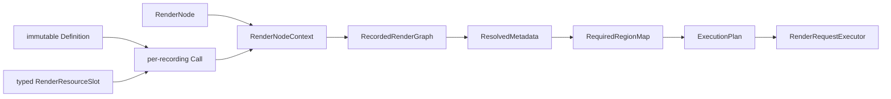

# Data Model: Renderer-Wide GPU Pass Fusion

## Relationship overview

```mermaid
flowchart LR
    N[RenderNode] --> C[RenderNodeContext]
    C --> G[RecordedRenderGraph]
    D[immutable Definition] --> K[per-recording Call]
    S[typed RenderResourceSlot] --> K
    K --> C
    G --> M[ResolvedMetadata]
    M --> R[RequiredRegionMap]
    R --> P[ExecutionPlan]
    P --> E[RenderRequestExecutor]
```

The public model records an immutable operation shape and a request-local invocation of that shape. The internal model resolves the complete graph only after all nodes have recorded.

## Public authoring entities

### RenderNode

`RenderNode` owns application state and implements `void Process(RenderNodeContext)`. `ChildNodes` exposes content dependencies in recording order but does not transfer ownership.

`HasChanges` is the public content-invalidation signal. A node sets it when a property can change pixels, bounds, hit testing, or topology. The renderer observes and clears it as part of successful request processing, invalidating that node and its recorded ancestors without resetting unchanged descendants. Public node code does not expose or supply output-reuse identities.

### RenderNodeContext

The engine creates one sealed context for each `Process` invocation. It exposes borrowed `Inputs`, request intent/purpose/domain/scale metadata, and recording methods. It is invalid after the invocation returns.

Publication is explicit:

| Method | Meaning |
|---|---|
| `PassThrough` | Publish all inputs unchanged and ordered. |
| `Publish` / `PublishRange` | Publish authored outputs at their intended painter position. |
| `PublishMappedInputs` | Map each input to exactly one published output in the same order. |
| `Drop` | Abandon an unpublished handle. |

`PublishMappedInputs` runs synchronously. Its callback may record intermediate handles but cannot publish; a violation rolls back the transaction. It is not a general map/flat-map primitive.

### RenderFragmentHandle

A handle represents a fragment in the active recording transaction. It carries no public executable canvas or persistent ownership. Methods return handles; publication makes them node outputs. Metadata and hit testing can be unavailable until enclosing target information is resolved.

### Definitions and calls

A public callback operation has these two entities:

| Entity | Holds |
|---|---|
| `*Definition<TState>` | Fixed callback code, operation metadata, and resource-slot schema. |
| `*Call<TState>` | State and resource bindings for one recording. |

Definitions are immutable and are commonly static/shared when their fixed shape is unchanged to avoid allocation. Equivalent definitions recreated later still share an engine-derived plan because equivalence comes from callback code and declared metadata, not object lifetime. Calls are created by `.Call(state, bindings)` for each recording. Changing call state is ordinary node content change and requires the owning node to set `HasChanges` before the next request.

The rendering context accepts:

- `OpaqueRenderCall<TState>` through source, map, combine, and expansion methods;
- `TargetScopeCall<TState>` and `TargetCommandCall<TState>` for guarded target work;
- `RawTargetScopeCall<TState>` and `RawTargetCommandCall<TState>` for opaque external canvas work;
- `ShaderCall<TState>` and `GeometryCall<TState>` for value transforms.

### RenderResource and RenderResourceSlot

`RenderResource<T>` is an opaque request-scoped token. `RenderNodeContext.Own` transfers a disposable raw object to the request family; `Borrow` leaves ownership with the caller. Neither changes output invalidation semantics.

`RenderResourceSlot<T>` is a typed address declared by a definition. `slot.Bind(token)` creates the only valid public binding form. A call binds every declared slot exactly once and cannot bind an undeclared or differently typed token.

Guarded sessions use `UseResource(slot, callback)` to lease the matching raw value. Raw sessions intentionally use `UseResource(token, callback)` because their callback boundary is request-local; the token remains in call state and the same token is also bound to a typed slot for validation.

### ShaderDefinition and GeometryDefinition

`ShaderDefinition<TState>` fixes source, entry-point kind, bounds behavior, uniforms, and child-shader slots. `.CurrentPixel` models `half4 apply(half4 color)`; `.WholeSource` models `half4 main(float2 coord)` with `uniform shader src;`. `ShaderDefinitionBuilder<TState>` maps call state to uniforms and declares typed child resources. `.Call` yields the `ShaderCall<TState>` passed to `RenderNodeContext.Shader` or `FilterEffectContext.Shader`.

`GeometryDefinition<TState>` fixes a geometry callback, bounds, hit testing, optional readback, and slots. `.Call` yields the `GeometryCall<TState>` passed to the corresponding context method.

### Raw target definitions

Raw definitions declare metadata and typed slots even though their canvas work is opaque external. A raw scope wraps and replays one input exactly once. A raw command has no logical value input. Both prevent persistent output reuse because the renderer cannot inspect their internal canvas behavior.

### Metadata contracts

Definitions use `RenderBoundsContract`, `RenderHitTestContract`, `RenderScaleContract`, `RenderValueCardinality`, target region/access, input readback, and device-grid contracts as appropriate. Metadata callbacks are deterministic, side-effect-free, and non-capturing. The engine derives operation-shape information from the definition and contract callbacks.

`RenderScaleContract.MapInputSupply` accepts a pure one-input supply transform and can be reevaluated after symbolic upstream metadata becomes concrete.

## Recorded request entities

### RenderRequestOptions

Options carry intent, purpose, optional target domain, requested region, output and maximum working scales, and the renderer's execution policy. A complete render request owns one active recording transaction and all temporary state required to finish or roll it back.

### RecordedRenderGraph

The graph preserves authored painter order and consists of ordered fragments plus embedded value edges. Nested same-target recording remains in this graph. Separate-target work records a child request before parent execution.

### RenderFragment

A fragment has ordered inputs, conservative bounds/scale/cardinality metadata, contribution behavior, hit-test provenance, and an execution payload. Value fragments can be transformed or combined. Target effects remain ordinary ordered fragments even when they produce no value.

### Target scopes, commands, and captures

Guarded scopes and commands declare their target behavior. Captures form explicit target-to-value edges. A finite layer may materialize mixed painter work into one value; a target-layer scope stays an effectful scope. Raw scope/command fragments conservatively form opaque external boundaries.

## Analysis and planning entities

### ResolvedMetadata and RequiredRegionMap

Forward analysis resolves conservative output bounds, hit-test provenance, value cardinality, and effective supply. Backward analysis maps requested output regions to the required regions of their producers. Symbolic target dependencies become concrete only after their enclosing scopes are known.

### CacheCandidate and retained output

The renderer may select a safe retained-output candidate after complete graph analysis. Node content invalidation is driven by `HasChanges`; authors do not define cache fields or token content identities. Raw target fragments and other opaque/external boundaries are not candidates for persistent reuse.

### ExecutionIsland and ExecutionPlan

The planner partitions the graph at materialization, target dependencies, readback, backend transitions, raw work, and unsupported fusion seams. It may combine compatible current-pixel shader stages into one island while preserving fragment order, bounds, scale, color/alpha semantics, and target behavior.

### StructuralPlan and RuntimeBindings

An internal plan records fixed graph topology, operation schemas, shader source/binding layout, barriers, and allocation shape. Request-time bindings contain current call state, request-scoped resources, resolved bounds/regions, densities, target allocation data, and frame inputs. The engine owns this split; public authoring supplies definitions and calls only.

### ResourcePlan and ResourceLease

The resource plan calculates first/last use for materialized values and manages pooled targets. A lease has one owner at a time and is released, transferred, or disposed exactly once. Externally borrowed root/presentation targets are never pooled or disposed by the request.

### CompiledShaderRun

A compiled shader run stores merged source/binding layout and backend capability requirements. Runtime uniforms and child resources bind after final bounds, density, and target allocation are known. Full program equality guards any hash lookup.

## Request lifecycle

1. Begin a request and record each node transactionally.
2. Lower scope-local target dependencies and resolve forward metadata.
3. Propagate required regions backward and select eligible retained-output substitutions/captures.
4. Build islands, shader runs, and resource leases.
5. Execute in dependency and painter order.
6. Publish retained output only after complete success, then settle all leases and resource transfers.

Any failure invalidates sessions/handles, suppresses partial output, preserves the primary failure, and performs remaining cleanup best-effort.

## Evidence is not request state

Test probes, renderer statistics, golden artifacts, and benchmark measurements observe recording, planning, allocation, and execution. They are not mutable state carried by production requests or public callbacks.
