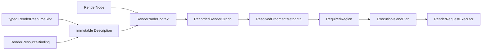

# Data Model: Renderer-Wide GPU Pass Fusion

## Relationship overview

```mermaid
flowchart LR
    N[RenderNode] --> C[RenderNodeContext]
    C --> G[RecordedRenderGraph]
    S[typed RenderResourceSlot] --> D[immutable Description]
    B[RenderResourceBinding] --> D
    D --> C
    G --> M[ResolvedFragmentMetadata]
    M --> R[RequiredRegion]
    R --> P[ExecutionIslandPlan]
    P --> E[RenderRequestExecutor]
```

The public model records an immutable description per operation; the engine derives that operation's shape from it and keys a plan on the shape alone. The internal model resolves the complete graph only after all nodes have recorded.

## Public authoring entities

### RenderNode

`RenderNode` owns application state and implements `void Process(RenderNodeContext)`. `ChildNodes` exposes content dependencies in recording order but does not transfer ownership.

`HasChanges` is the public content-invalidation signal, and it is read-only: a node raises it by calling `MarkChanged()` when a property can change pixels, bounds, hit testing, or topology. The renderer observes and clears it as part of successful request processing, invalidating that node and its recorded ancestors without resetting unchanged descendants. Public node code does not expose or supply output-reuse identities.

### RenderNodeContext

The engine creates one sealed context for each `Process` invocation. It exposes borrowed `Inputs`, request intent/purpose/domain/scale metadata, and recording methods. It is invalid after the invocation returns.

`IsRenderCacheEnabled` reports whether the current transaction is still cache-eligible, and `DisableRenderCache()` monotonically opts the node out. A node that records a child it does not list in `ChildNodes` must call `DisableRenderCache`, because the cache cannot observe a change reported only by that unlisted child.

Publication is explicit:

| Method | Meaning |
|---|---|
| `PassThrough` | Publish all inputs unchanged and ordered. |
| `Publish` / `PublishRange` | Publish authored outputs at their intended painter position. |
| `PublishMappedInputs` | Map each input to exactly one published output in the same order. |
| `Drop` | Abandon an unpublished handle. |

`PublishMappedInputs` runs synchronously. Its callback may record intermediate handles but cannot publish; a violation rolls back the transaction. It is not a general map/flat-map primitive.

### RenderFragmentHandle

A handle represents a fragment in the active recording transaction. It carries no public executable canvas or persistent ownership. Methods return handles; publication makes them node outputs. Metadata and hit testing can be unavailable until enclosing target information is resolved.

### Operation descriptions

A public callback operation is one immutable description. It holds the execution callback, the state that callback reads, the operation metadata, and the resource slots the operation declares together with the bindings that fill them. There is no separate schema object: a description is built where it is recorded and handed straight to the context method that records it.

A plan is keyed by the shape of the work — the callback's method and the declared contracts — and never by the values a recording carries, so a description rebuilt each request compiles the same plan. Changing the state a description carries is ordinary node content change and requires the owning node to call `MarkChanged()` before the next request.

The rendering context accepts:

- `OpaqueRenderDescription` through source, map, combine, and expansion methods;
- `TargetScopeDescription` and `TargetCommandDescription` for guarded target work;
- `RawTargetScopeDescription` and `RawTargetCommandDescription` for opaque external canvas work;
- `ShaderDescription` and `GeometryDescription` for value transforms;
- `MaterializedInputDescription` and `TargetCaptureDescription` for the two callback-free operations.

A painted source has no description and is recorded through `RenderNodeContext.PaintedSource<TState>` directly, because it borrows its fill and its pen from the recording transaction and whether either paints a drawable brush decides the plan key while the call is being made.

### RenderResource and RenderResourceSlot

`RenderResource<T>` is an opaque request-scoped token. `RenderNodeContext.Own` transfers a disposable raw object to the request family; `Borrow` leaves ownership with the caller. Neither changes output invalidation semantics.

`RenderResourceSlot<T>` is a typed address. A description declares its slots in `slots:` and binds each one exactly once in `resources:`, where `slot.Bind(token)` creates the only valid public binding form; an undeclared or differently typed token is rejected. Declaring the slots is also what orders the bindings, since the order reaches the operation's structural identity. Omitting the slot list declares none rather than skipping the check.

Guarded sessions use `UseResource(slot, callback)` to lease the matching raw value. Raw sessions additionally offer `UseResource(token, callback)` for a callback that needs the resource by identity; the token then lives in the description's state and the same token is also bound to a declared slot for validation.

### ShaderDescription and GeometryDescription

`ShaderDescription` holds source, entry-point kind, bounds behavior, uniforms, and child-shader slots. `.CurrentPixel` models `half4 apply(half4 color)`; `.WholeSource` models `half4 main(float2 coord)` with `uniform shader src;`. Both take an `Action<ShaderBindingBuilder>` that runs immediately, while the description is being constructed, and is never retained; `ShaderBindingBuilder` writes canonical uniform values, registers execution-time uniform binders, and declares typed child resources. `SkslSource.CurrentPixel` and `SkslSource.WholeSource` parse and validate the text once so several descriptions can share it. The result is passed to `RenderNodeContext.Shader` or `FilterEffectContext.Shader`.

`GeometryDescription` holds a geometry callback, bounds, hit testing, optional readback, an optional input demand, and slots, and is passed to the corresponding context method.

### Raw target descriptions

Raw descriptions declare metadata and typed slots even though their canvas work is opaque external, and both take state like every other description. A raw scope wraps and replays one input exactly once. A raw command has no logical value input. Both prevent persistent output reuse because the renderer cannot inspect their internal canvas behavior — the opaque canvas is the reason, not the absence of state passing.

### Metadata contracts

Descriptions use `RenderBoundsContract`, `RenderHitTestContract`, `RenderScaleContract`, `RenderValueCardinality`, target region/access, input readback, and device-grid contracts as appropriate. Metadata callbacks are deterministic and side-effect-free, and may capture only lightweight immutable CPU values and the `RenderNode` that declares them, never a resource, context, request graph, mutable payload, or capturing delegate. A node's own properties are therefore readable from its metadata callbacks; what such a callback answers is request data, and a recorded answer that no longer holds at graph-wide metadata resolution fails the request. The execution-time uniform and resource binders registered through `ShaderBindingBuilder` are held to the same terms. The engine derives operation-shape information from the description's callbacks and declared contracts.

`RenderScaleContract.MapInputSupply` accepts a pure one-input supply transform together with the backward demand transform that matches it; `RenderScaleContract.MapInputSupplyPreservingDemand` accepts the supply transform alone and leaves demand unchanged. Both are reevaluated after symbolic upstream metadata becomes concrete.

## Recorded request entities

### RenderRequestOptions

Options carry intent, purpose, optional target domain, requested region, output and maximum working scales, and the renderer's execution policy. A complete render request owns one active recording transaction and all temporary state required to finish or roll it back.

### RecordedRenderGraph

The graph preserves authored painter order and consists of ordered fragments plus embedded value edges. Nested same-target recording remains in this graph. Separate-target work records a child request before parent execution.

### RecordedRenderFragment and RenderFragmentReference

A fragment has ordered inputs, conservative bounds/scale/cardinality metadata, contribution behavior, hit-test provenance, and an execution payload. Value fragments can be transformed or combined. Target effects remain ordinary ordered fragments even when they produce no value.

### Target scopes, commands, and captures

Guarded scopes and commands declare their target behavior. Captures form explicit target-to-value edges. A finite layer may materialize mixed painter work into one value; a target-layer scope stays an effectful scope. Raw scope/command fragments conservatively form opaque external boundaries.

## Analysis and planning entities

### ResolvedFragmentMetadata and RequiredRegion

Forward analysis resolves conservative output bounds, hit-test provenance, value cardinality, and effective supply. Backward analysis maps requested output regions to the required regions of their producers. Symbolic target dependencies become concrete only after their enclosing scopes are known.

### RenderCacheCandidate and retained output

The renderer may select a safe retained-output candidate after complete graph analysis. Node content invalidation is driven by `HasChanges`; authors do not define cache fields or token content identities. Raw target scope/command fragments, fragments carrying an external target-token dependency, and filter-effect segments that cannot materialize are not candidates for persistent reuse.

### ExecutionIsland and ExecutionIslandPlan

The planner partitions the graph at materialization, target dependencies, readback, backend transitions, raw work, and unsupported fusion seams. It may combine compatible current-pixel shader stages into one island while preserving fragment order, bounds, scale, color/alpha semantics, and target behavior.

*Amended.* Fusion was widened past current-pixel color shaders in `991f49e70`. An island may now also fold an engine-proven invariant opacity stage, and a single whole-source shader may lead a fused run of downstream current-pixel or opacity stages, though it never consumes an upstream stage within that run. `research.md` and `plan.md` carry the current fusion-scope contract.

### StructuralPlanCache and request-time binding

An internal plan records fixed graph topology, operation schemas, shader source/binding layout, barriers, and allocation shape. Request-time bindings contain the state each description carried, request-scoped resources, resolved bounds/regions, densities, target allocation data, and frame inputs. The engine owns this split; public authoring supplies descriptions only.

### ResourcePlanUseSchedule and RenderTargetLease

The resource plan calculates first/last use for materialized values and manages pooled targets. A lease has one owner at a time and is released, transferred, or disposed exactly once. Externally borrowed root/presentation targets are never pooled or disposed by the request.

### CompiledShaderRun

A compiled shader run stores merged source/binding layout and backend capability requirements. Runtime uniforms and child resources bind after final bounds, density, and target allocation are known. Full program equality guards any hash lookup.

## Request lifecycle

1. Begin a request and record each node transactionally.
2. Lower scope-local target dependencies and resolve forward metadata.
3. Propagate required regions backward and select eligible retained-output substitutions/captures.
4. Build islands, shader runs, and resource leases.
5. Execute in dependency and painter order.
6. Publish retained output only after complete success, then settle all leases and resource transfers.

Any failure invalidates sessions/handles, suppresses partial output, preserves the primary failure, and performs remaining cleanup best-effort.

## Evidence is not request state

Test probes, renderer statistics, golden artifacts, and benchmark measurements observe recording, planning, allocation, and execution. They are not mutable state carried by production requests or public callbacks.
